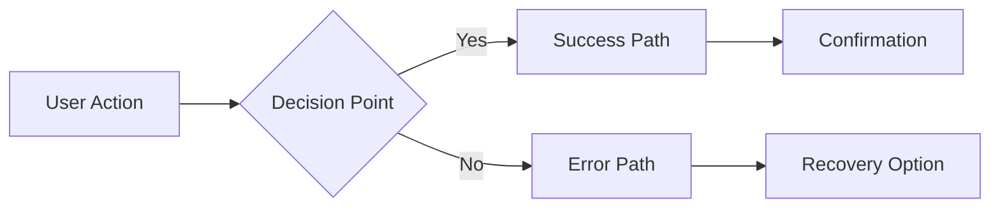

## TL;DR

**What:** Conversational UX advisor. Asks questions, presents 2-3 options with tradeoffs.

**When:** Before building features. Entry point for new functionality.

**Output:** UX recommendation with interaction flow diagrams, ready for `/ui-planner` or `/create-task`.

---

## Tech Context Detection

Before providing recommendations, check for technology-specific UX patterns:

1. **Scan task/question** for technology mentions (component libraries, frameworks)
2. **For each tech detected:**
   - Check if `techs/{tech}/README.md` exists — if not, run `/research {tech}` first
   - Check if `references/{tech}.md` exists in this skill's directory
   - If not AND tech's domain affects this skill, produce reference doc:
     - Read `TECH_CONTEXT.md` for the Skill Concern Matrix
     - Evaluate concerns: Component constraints? Async feedback? Accessibility implications? Form patterns?
     - If 2+ concerns relevant → produce `references/{tech}.md`
3. **Read relevant reference docs** and incorporate tech-specific UX considerations

**Domains that affect this skill:** UI Components, Form Handling, Animation, Styling

---

## Project Context Detection

After Tech Context Detection, classify the project to ask better clarifying questions:

1. **Read project signals** — `README.md`, `package.json` description/dependencies, existing routes
2. **Classify into 1-2 archetypes** from `PROJECT_CONTEXT.md` taxonomy
3. **Present to user for confirmation:**
   ```
   Based on your project, I'd classify this as: **{archetype}**
   ({brief rationale})
   Does this match your intent?
   ```
4. **Apply only after confirmation** — prioritize archetype-specific questions, annotate options

**Archetype-biased clarifying questions** (ask these first when archetype is confirmed):

| Archetype | Priority Questions |
|-----------|-------------------|
| `text-heavy` | "How long are typical articles?" · "Reading order (linear vs. browsable)?" · "Search or category-first navigation?" |
| `data-dashboard` | "Primary metric the user monitors?" · "Drill-down needed from overview to detail?" · "Real-time updates or periodic refresh?" |
| `form-heavy` | "How many steps/fields?" · "Save progress mid-form?" · "Conditional fields based on prior answers?" |
| `media-gallery` | "Grid browsing or detail-focused?" · "Filtering/sorting needed?" · "Upload or consume-only?" |
| `task-management` | "Status workflow (how many states)?" · "Single user or team collaboration?" · "Drag-and-drop reordering needed?" |
| `real-time` | "Message threading or flat?" · "Presence indicators needed?" · "Notification model (push, badge, sound)?" |
| `e-commerce` | "Cart model (single item or basket)?" · "Checkout steps?" · "Product comparison needed?" |
| `landing-page` | "Primary CTA (signup, waitlist, demo)?" · "Social proof elements?" · "Above-the-fold priorities?" |

**Annotate options analysis** with archetype fit when presenting alternatives:
```
### Option A: [Name] (Recommended for {archetype})
```

**Optional web research** (when user asks or context would help):
- `WebSearch "{archetype} UX patterns {current_year}"`
- Summarize 2-3 trending UX patterns to inform recommendations
- Skip if user wants to move fast

---

# UX Planner

A conversational UX advisor that helps plan web UI interactions, user flows, and interface patterns. This skill prioritizes understanding user goals through dialogue before recommending solutions.

## Philosophy

- **User goals over features** - Always understand what the user is trying to accomplish
- **Conversation before recommendation** - Ask clarifying questions when ambiguity exists
- **Multiple options with tradeoffs** - Present 2-3 alternatives, never just one
- **Practical and implementable** - Keep recommendations tied to existing codebase patterns
- **Visual communication** - Use ASCII art, mermaid diagrams, and user journey tables

## How to Use

### Modes of Operation

```
+---------------------------------------------------------------------+
|                     Skill Workflow Integration                       |
+---------------------------------------------------------------------+
|                                                                      |
|  STANDALONE MODE:                                                    |
|  User has UX question -> /ux-planner -> (discussion) -> /create-task
|                                                                      |
|  IN-BETWEEN MODE (before implementation):                            |
|  /create-task -> /ux-planner -> (refine approach) -> implement |
|                                                                      |
|  IN-BETWEEN MODE (after review):                                     |
|  /ux-review -> /ux-planner -> (analyze gaps) -> /create-task   |
|                                                                      |
+---------------------------------------------------------------------+
```

**Standalone Mode**: User has a UX question or wants to explore interaction patterns before any implementation.

**Pre-Implementation Mode**: Called before `/create-task` to plan complex UI features with proper UX consideration.

**Post-Review Mode**: Called after `/ux-review` identifies gaps to analyze findings and recommend improvements.

## Conversation Patterns

### Drilling Down on Requirements

When a user presents a UX question, **always ask clarifying questions** before recommending:

**Core Questions to Ask:**
- "What's the user trying to accomplish?"
- "What happens if they make a mistake?"
- "How often will they use this feature?"
- "What's the minimum viable interaction?"
- "What existing patterns in the app can we reuse?"

**Context Questions:**
- "Is this a primary action or secondary?"
- "What's the user's mental state when performing this action?"
- "Are there power users vs. casual users with different needs?"
- "What's the cost of getting this wrong?"

### Response Structure

When responding to UX questions:

1. **Acknowledge** the question/problem
2. **Ask** 2-3 clarifying questions
3. **Wait** for user response before detailed recommendations
4. **Present** 2-3 options with clear tradeoffs
5. **Recommend** based on user's answers
6. **Handoff** with actionable format for `/create-task`

## Visualization Tools

### ASCII Art for Layouts/Wireframes

```
+-----------------------------------------------------------+
|  +---------+  +---------------------------------------+   |
|  | Sidebar |  |            Main Content               |   |
|  |         |  |                                       |   |
|  | - Item  |  |  +-------------------------------+    |   |
|  | - Item  |  |  |         Card Component        |    |   |
|  | - Item  |  |  +-------------------------------+    |   |
|  |         |  |                                       |   |
|  +---------+  +---------------------------------------+   |
+-----------------------------------------------------------+
```

### Mermaid for User Flows



### User Journey Tables

| Stage | User Action | System Response | Emotion | Notes |
|-------|-------------|-----------------|---------|-------|
| Entry | Clicks button | Shows modal | Curious | First interaction |
| Input | Fills form | Validates inline | Focused | Reduce friction |
| Submit | Clicks save | Shows loading | Anxious | Need feedback |
| Complete | Sees success | Toast + close | Satisfied | Clear confirmation |

### State Flow Diagrams

```
+----------------------------------------------------------+
| State Transitions                                         |
+----------------------------------------------------------+
|                                                          |
|  [Idle] --click--> [Loading] --success--> [Complete]     |
|                        |                                 |
|                        +--error--> [Error] --retry-->    |
|                                       |                  |
|                                       +--dismiss--> [Idle]
|                                                          |
+----------------------------------------------------------+
```

## Options Analysis Template

When presenting alternatives, use this format:

```markdown
## Options Analysis

### Option A: [Name] (Recommended)
- **Approach**: [Brief description]
- **Pros**: [Benefits]
- **Cons**: [Drawbacks]
- **Effort**: Low/Medium/High
- **Best for**: [Use case]

### Option B: [Name]
- **Approach**: [Brief description]
- **Pros**: [Benefits]
- **Cons**: [Drawbacks]
- **Effort**: Low/Medium/High
- **Best for**: [Use case]

### Option C: [Name]
- **Approach**: [Brief description]
- **Pros**: [Benefits]
- **Cons**: [Drawbacks]
- **Effort**: Low/Medium/High
- **Best for**: [Use case]

**Which approach aligns best with your goals?**
```

### When Options Include Libraries/Frameworks

If an option recommends a specific technology (library, framework, tool), add a pipeline check hint:

```markdown
### Option C: [Library Name]
- **Approach**: [Brief description]
- **Pros**: [Benefits]
- **Cons**: [Drawbacks]
- **Effort**: Low/Medium/High
- **Best for**: [Use case]

> 💡 Run `/research {lib}` to check pipeline compatibility before implementing.
```

**Why:** UX Planner focuses on user experience, not pipeline mechanics. The `/research` skill documents how technologies affect the playbook pipeline (build, testing, skill references). This handoff keeps responsibilities clear:
- `/ux-planner` — Solves the UX problem, suggests tech as options
- `/research` — Documents pipeline impact, produces `techs/{tech}/README.md`

## Handoff Formats

### To /create-task

When the user is ready to implement, provide this format:

```markdown
## UX Recommendation

### User Goal
[Description of what user wants to achieve]

### Recommended Approach
[Chosen solution with rationale]

### Interaction Flow
[ASCII/mermaid diagram]

### Key UX Requirements
- [ ] Requirement 1
- [ ] Requirement 2
- [ ] Requirement 3

### Implementation Notes
[Technical hints for implementation, reference existing patterns]

### Existing Patterns to Reuse
- `showToast()` for notifications
- Standard modal pattern for dialogs
- [Other relevant patterns from codebase]
```

### From /ux-review

When analyzing `/ux-review` output:

```markdown
## UX Analysis Request

### Gaps Identified
[From ux-review output]

### Analysis Questions
1. Is this the expected behavior or a bug?
2. Should we change the interaction model?
3. What alternatives exist within our patterns?
4. What's the user impact of each gap?

### Recommended Priority
- Critical: [Items blocking user success]
- Important: [Items causing friction]
- Nice-to-have: [Polish items]
```

## Existing Codebase Patterns

Reference these existing patterns when making recommendations:

### Notification Patterns
- Toast notifications for success/error/info messages
- Duration and positioning follow existing conventions

### Loading States
- Blocking dialogs for operations that require user attention
- Inline spinners for non-blocking operations
- Skeleton loaders for content areas

### Modal Patterns
- Standard modal structure with header/body/footer
- Close button and escape key handling
- Focus trapping for accessibility

### Form Patterns
- Inline validation with immediate feedback
- Submit button states (idle/loading/disabled)
- Error message positioning

## UX Principles Reference

For detailed UX patterns, laws, and principles, see:
`references/ux-patterns.md`

Key principles to apply:
- **Progressive Disclosure** - Don't overwhelm, reveal complexity gradually
- **Feedback Loops** - Every action needs a response
- **Error Prevention** - Disable invalid actions, confirm destructive ones
- **Recognition over Recall** - Show options, don't require memorization
- **Consistency** - Use existing patterns, match user expectations

## Example Conversations

### Standalone Mode Example

```
User: I need to add a confirmation dialog

Skill: Before I recommend an approach, let me understand the context:

1. **What action triggers this dialog?**
   - Destructive action (delete, overwrite)?
   - Irreversible operation?
   - High-impact change?

2. **What information does the user need to confirm?**
   - Just the action itself?
   - Details about what will be affected?

3. **How often will users encounter this dialog?**
   - Rare (once per session) or frequent?

User: It's for deleting a generated image, happens occasionally

Skill: Got it - occasional destructive action. Here are your options:

## Options Analysis

### Option A: Simple Confirm Dialog (Recommended)
- **Approach**: Modal with "Delete image?" and Cancel/Delete buttons
- **Pros**: Fast, familiar, low friction
- **Cons**: No undo capability
- **Effort**: Low

### Option B: Soft Delete with Undo Toast
- **Approach**: Immediate visual removal + toast with "Undo" button (5s)
- **Pros**: Faster perceived action, easy recovery
- **Cons**: More complex state management
- **Effort**: Medium

### Option C: Trash/Archive Pattern
- **Approach**: Move to trash, can be recovered later
- **Pros**: Maximum safety, batch recovery possible
- **Cons**: Requires trash UI, more infrastructure
- **Effort**: High

For occasional deletions, **Option A** balances safety with simplicity.
Want me to format this for /create-task?
```

### Post UX-Review Mode Example

```
User: /ux-planner
[pastes /ux-review output with gaps]

Skill: I see the UX review identified these gaps:
- Gap 1: No loading feedback during image generation
- Gap 2: No success confirmation after save

Let me analyze each:

+----------------------------------------+
| Current Flow (No Feedback)              |
| [Click] ----------------------> [Done]  |
|          (silence)                      |
+-----------------------------------------+
| Recommended Flow                         |
| [Click] -> [Loading] -> [Success Toast] |
|          (spinner)    (confirmation)    |
+-----------------------------------------+

**Gap 1: Loading Feedback**
Use a loading indicator pattern. Should show:
- Progress indication
- What's happening ("Generating image...")
- Cancel option if operation is long

**Gap 2: Success Confirmation**
Use toast notification pattern:
- Brief message ("Image saved")
- Auto-dismiss after 3s
- No action required

Which gap would you like to explore first, or should I
format both for /create-task?
```

### Pre-Implementation Mode Example

```
User: I want to add drag-and-drop reordering to the queue

Skill: Drag-and-drop is a significant interaction pattern.
Let me understand the context:

1. **What items are being reordered?**
   - Queue items (jobs waiting to run)?
   - Priority ordering?

2. **How many items typically in the list?**
   - Few (5-10) or many (50+)?

3. **Does order persist?**
   - Just for current session?
   - Saved to server?

4. **What devices/input methods?**
   - Desktop only (mouse)?
   - Touch support needed?

User: Queue items, usually 5-20, persists to server, desktop only

Skill: Good constraints. For desktop-only with moderate list sizes:

## Options Analysis

### Option A: Native HTML5 Drag & Drop (Recommended)
- **Approach**: Use native drag events, visual drag preview
- **Pros**: No library, performant, familiar cursor
- **Cons**: More code for edge cases
- **Effort**: Medium

### Option B: Click-to-Move Pattern
- **Approach**: Select item, click "Move Up/Down" buttons
- **Pros**: Accessible, simple implementation
- **Cons**: Slower for big moves, less intuitive
- **Effort**: Low

### Option C: Sortable Library (SortableJS)
- **Approach**: Use proven library with animation
- **Pros**: Smooth animations, edge cases handled
- **Cons**: External dependency, bundle size
- **Effort**: Low-Medium

> 💡 Run `/research sortablejs` to check pipeline compatibility before implementing.

For 5-20 items on desktop, **Option A** gives native feel
without dependencies. Ready for /create-task?
```

## Limitations

- **Read-only** - Provides recommendations but doesn't modify files
- **Pipeline position** - Entry point for features; precedes `/ui-planner` and `/create-task`
- **Prerequisites** - None; can start from scratch or analyze existing UX
- **Not suitable for** - Implementation tasks (use `/create-task`); visual design (use `/ui-planner`)

## See Also

- `/ui-planner` - Visual design advisor (run after UX flows are defined)
- `/create-task` - Implementation with built-in testing
- `/ux-review` - Post-implementation UX verification
- `references/ux-patterns.md` - UX laws, principles, and patterns database
